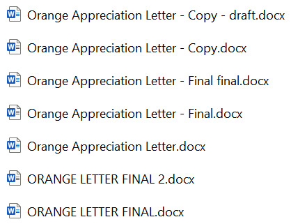

# Tools that I use in my work

I use most of the tools listed below regularly in my work as an electrical engineering student passionate about robotics. I find all of these fascinating, and would like to share that with you. Some of these are really standard tools that you'll find in any engineer's toolbox, while others are more niche. I hope you find something useful here.

Note that nothing here is sponsored, and I am not affiliated with any of the companies that make these tools. I just like them.

## 1.   Git for source control
How often have you had to deal with this?

I did pretty often. I've often lost track of which version of a document was the latest, and which one was the one I was supposed to be working on; and on occasion, I've even lost weeks of work because I accidentally overwrote a file.

Any of you that have used Google Docs or similar online tools would be laughing at me right now. But how do you do the same thing for *any* file on your computer, not just the ones that are supported by Google's office suite? This doesn't make sense for a document, but for a technical project, you could very well have multiple versions that are developed in parallel, and you need to keep track of all of them.

Enter [Git](https://git-scm.com/). Git is a source control system that allows you to keep track of all the changes you make to a file, and revert to any version you want. It's also great for collaborating with others, as it allows you to merge changes made by multiple people to the same file. It's by far the most popular [version control system (VCS)](https://about.gitlab.com/topics/version-control/) out there today.

### Resources to understand what Git is
Just pick one of these and read it, these are just an overview.
*   https://www.atlassian.com/git/tutorials/what-is-version-control
*   https://en.wikipedia.org/wiki/Version_control
*   https://www.atlassian.com/git/tutorials/what-is-git
*   https://www.youtube.com/watch?v=hwP7WQkmECE

### Resources to learn how to use Git
*   [\[YT Playlist\] TheNetNinja](https://youtube.com/playlist?list=PL4cUxeGkcC9goXbgTDQ0n_4TBzOO0ocPR) (this is what I used when I learnt Git)
*   [\[YT Video\] Fireship](https://www.youtube.com/watch?v=HkdAHXoRtos)
*   [\[Articles\] GitHub](https://docs.github.com/en/github/getting-started-with-github)
*   [Official Git documentation](https://git-scm.com/docs/gittutorial)

### Important concepts you should look into
*   GitHub/GitLab/BitBucket or other Git hosting services
*   Git branching
*   Issues and [pull requests](https://www.youtube.com/watch?v=HkdAHXoRtos)
*   The `.gitignore` file
*   Rectifying merge conflicts

### Interesting tidbit
One hour talk by the creator of Git, Linus Torvalds: https://www.youtube.com/watch?v=4XpnKHJAok8